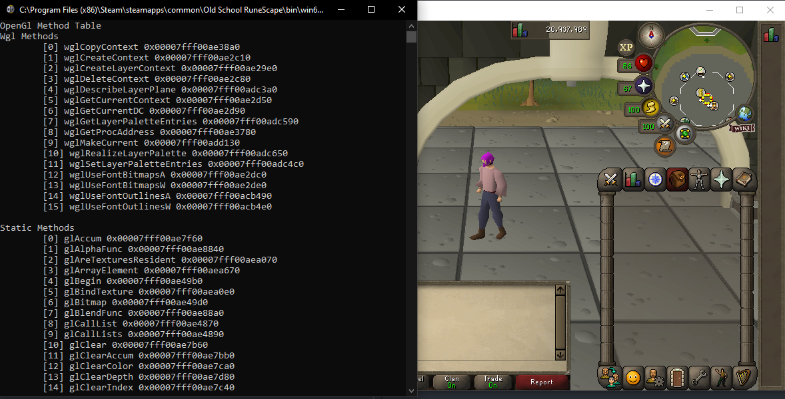

[](https://crates.io/crates/shroud)
# Shroud
Universal library for discovering common render engines functions.
Supports DirectX9 (D3D9), DirectX10 (D3D10), DirectX11 (D3D11), DirectX12 (D3D12), OpenGL, Vulkan.
Currently only supports Windows, but OpenGL and Vulkan are candidates for making cross platform.

## Purpose
Provide access to common render engine functions so that they can be hooked/augmented.
For instance the DirectX9 EndScene hook, DirectX11 Present Hook, and OpenGL wglSwapBuffers hook.

## Support
- [x] DirectX9
- [ ] DirectX10
- [x] DirectX11
- [x] DirectX12
- [x] OpenGL
- [x] Vulkan

## How to use
In your `cargo.toml` specify the shroud dependency and the render engines you would like access to as feature flags.
By default all render engines are enabled, which you probably do not need.

For example targeting a DirectX9 Host/Game
```Toml
[dependencies]
shroud = { version = "0.1.1", default-features = false, features = ["directx9"] }
```

And targeting a DirectX12 Host/Game..
```Toml
[dependencies]
shroud = { version = "0.1.1", default-features = false, features = ["directx12"] }
```

## Injected Demos / Use Case
The example code compiled as a dll and injected provides the results you see in the below demos.
```Rust
// use shroud::directx::directx9;
// use shroud::directx::directx10;
// use shroud::directx::directx11;
// use shroud::opengl;
// use shroud::vulkan;
use shroud::directx::directx12;

use winapi::shared::minwindef::{BOOL, DWORD, HINSTANCE, LPVOID, TRUE};
use winapi::um::consoleapi::AllocConsole;
use winapi::um::winnt::DLL_PROCESS_ATTACH;

#[allow(clippy::missing_safety_doc)]
unsafe extern "system" fn dll_attach(_base: LPVOID) -> u32 {
    AllocConsole();

    // match directx9::methods
    // match directx10::methods
    // match directx11::methods
    // match opengl::methods
    // match vulkan::methods
    match directx12::methods() {
        Ok(methods) => {
            println!("{:#?}", methods);
        }
        Err(err) => {
            println!("Error on Methods Find: {:?}", err);
        }
    }
    0
}


// Dll Entry Function, immediately spawn thread and do our business else where
#[no_mangle]
#[allow(non_snake_case)]
#[allow(clippy::missing_safety_doc)]
pub unsafe extern "system" fn DllMain(
    module: HINSTANCE,
    call_reason: DWORD,
    _reserved: LPVOID,
) -> BOOL {
    if call_reason == DLL_PROCESS_ATTACH {
        winapi::um::processthreadsapi::CreateThread(
            std::ptr::null_mut(),
            0,
            Some(dll_attach),
            module as _,
            0,
            std::ptr::null_mut(),
        );

        TRUE
    } else {
        TRUE
    }
}
```

### OpenGL


### DirectX9


### DirectX10
Todo...

### DirectX11


### DirectX12


### Vulkan
Todo...