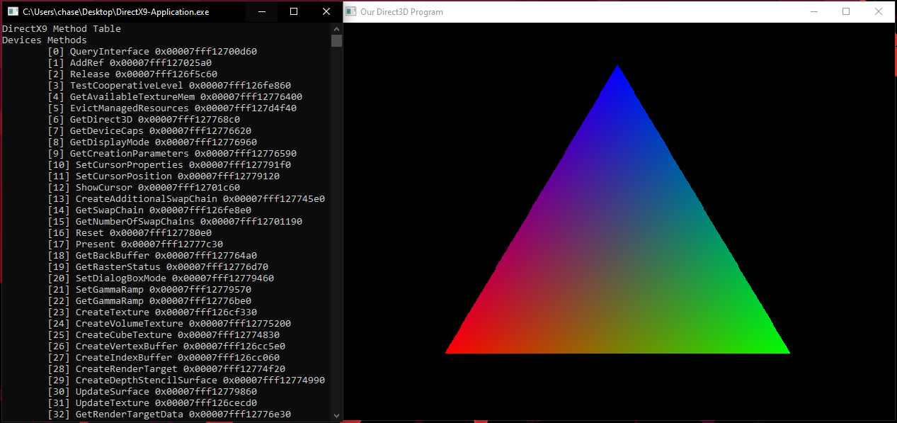
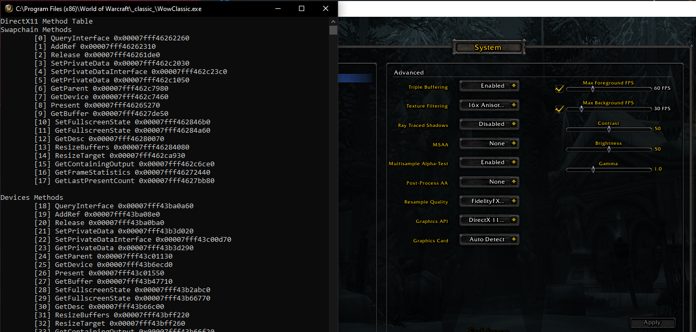
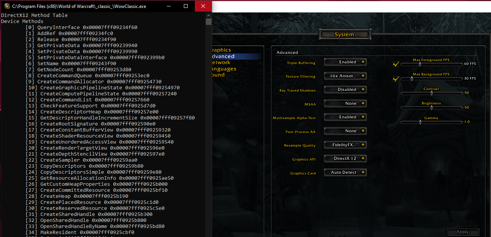

[](https://crates.io/crates/shroud)
# Shroud
Universal library for discovering common render engines functions.
Supports DirectX9 (D3D9), DirectX10 (D3D10), DirectX11 (D3D11), DirectX12 (D3D12).
Currently only supports Windows, but OpenGL and Vulkan are candidates for making cross platform.

## Purpose
Provide access to common render engine functions so that they can be hooked/augmented.
For instance the DirectX9 EndScene hook, DirectX11 Present Hook.

## Change Log
- 0.1.0
Began as universal library for opengl and vulkan
Used winapi unofficial api, prior to windows crate adoption.

- 0.2.0 
Removes OpenGl/Vulkan. There is better solutions for their loaders.
Upgrades to Official microsoft windows crate.

## Support
- [x] DirectX9
- [ ] DirectX10**
- [x] DirectX11
- [x] DirectX12

** Untested

## How to use
In your `cargo.toml` specify the shroud dependency and the render engines you would like access to as feature flags.
By default all render engines are disabled.

For example targeting a DirectX9 Host/Game
```Toml
[dependencies]
shroud = { version = "0.2.0", features = ["directx9"] }
```

And targeting a DirectX12 Host/Game..
```Toml
[dependencies]
shroud = { version = "0.2.0", features = ["directx12"] }
```

## Injected Demos / Use Case
The example code compiled as a dll and injected provides the results you see in the below demos.
```Rust
use windows::Win32::{
    Foundation::{BOOL, HMODULE},
    System::{Console::AllocConsole, SystemServices::DLL_PROCESS_ATTACH},
};

unsafe extern "system" fn start_routine(_parameter: *mut std::ffi::c_void) -> u32 {
    // match shroud::directx9::methods
    // match shroud::directx10::methods
    // match shroud::directx11::methods
    match shroud::directx12::methods() {
        Ok(m) => {
            println!("{m:#?}");
        }
        Err(e) => {
            println!("{e:?}");
        }
    }
    0
}

#[no_mangle]
#[allow(non_snake_case)]
pub extern "system" fn DllMain(dll_module: HMODULE, call_reason: u32, _reserved: usize) -> BOOL {
    if call_reason == DLL_PROCESS_ATTACH {
        unsafe { AllocConsole() };
        println!("Attached.");

        let thread = unsafe {
            windows::Win32::System::Threading::CreateThread(
                None,
                0,
                Some(start_routine),
                Some(dll_module.0 as *const std::ffi::c_void),
                windows::Win32::System::Threading::THREAD_CREATION_FLAGS(0),
                None,
            )
        };

        match thread {
            Ok(_handle) => {
                println!("Created thread")
            }
            Err(e) => {
                panic!("Unable to create thread {e:?}")
            }
        }
    }

    true.into()
}
```

### DirectX9


### DirectX10
Todo...

### DirectX11


### DirectX12

